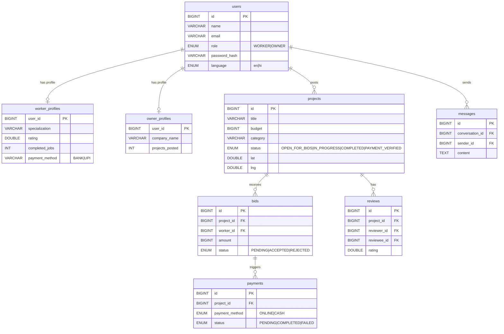

<div align="center">

# 🔨 LabourHand

### India's Trusted Blue-Collar Labour Marketplace

**Connecting skilled workers with quality job opportunities across India**

*भारत का सबसे विश्वसनीय प्लेटफॉर्म जो कुशल कामगारों को गुणवत्तापूर्ण नौकरी के अवसरों से जोड़ता है।*

---


</div>

---

## 📋 Table of Contents

- [Overview](#-overview)
- [Key Features](#-key-features)
- [Tech Stack](#-tech-stack)
- [Architecture](#-architecture)
- [Database Schema](#-database-schema)
- [API Reference](#-api-reference)
- [Frontend Pages](#-frontend-pages)
- [Getting Started](#-getting-started)
- [Project Structure](#-project-structure)
- [Security Model](#-security-model)
- [Contributing](#-contributing)

---

## 🌟 Overview

**LabourHand** is a full-stack web platform built to digitise the unorganised blue-collar labour market in India. It acts as a two-sided marketplace:

| User Type | Description |
|-----------|-------------|
| 👷 **Worker** | Skilled labourers (masons, electricians, plumbers, etc.) who browse projects, place bids, and get hired |
| 💼 **Owner / Employer** | Businesses or individuals who post construction/maintenance projects, compare bids, and manage work progress |

### Platform Statistics (Demo Data)
| Metric | Value |
|--------|-------|
| Active Workers | 50,000+ |
| Jobs Posted | 2,50,000+ |
| Average Rating | ⭐ 4.8 / 5 |
| Supported Languages | English, Hindi |

---

## ✨ Key Features

### For Workers 👷
- 🔐 **Secure Registration & Login** — JWT-based stateless authentication
- 📋 **Rich Worker Profile** — Specialization, years of experience, skills, bio, on-time rate, rehire rate
- 🏅 **Skills India Verification** — Government-backed certification badge
- 📍 **Location-Based Job Discovery** — Find projects within a configurable radius (km)
- 💸 **Competitive Bidding** — Set your own rates, submit proposals with estimated timelines
- 👥 **Team Bids** — Form a team and bid on large projects collectively
- 📊 **Progress Updates** — Post milestone updates with payment demands
- 💳 **Payment Details** — Store Bank / UPI payment information securely
- ⭐ **Ratings & Reviews** — Build reputation through verified project reviews
- 💬 **Real-Time Messaging** — Chat directly with employers via WebSocket
- 📅 **Schedule Management** — Track upcoming project schedules and timelines

### For Employers 💼
- 📝 **Project Posting** — Post jobs with category, budget (INR), location, and deadline
- 🗺️ **Geo-Tagged Projects** — Attach lat/lng for proximity-based worker matching
- 📂 **Bid Management** — View, compare, accept or reject bids from workers
- 🤝 **Bid Acceptance Flow** — Accept the best bid to move project to `IN_PROGRESS`
- 📈 **Progress Tracking** — Monitor worker-posted progress updates (0–100%)
- 💰 **Payment Processing** — Release payments (Online / Cash) tied to progress milestones
- ⭐ **Review Workers** — Rate workers after project completion
- 📊 **Earnings Tracking** — Revenue tracking per project per day

### Platform-Wide 🌐
- 🔒 **Spring Security + JWT** — Stateless, token-based auth for all protected endpoints
- 🌍 **CORS Configured** — Ready for cross-origin frontend consumption
- 📡 **WebSocket Support** — Real-time messaging infrastructure
- 📖 **Swagger / OpenAPI** — Interactive API documentation at `/swagger-ui.html`
- 🗃️ **17-Table Relational Schema** — Production-grade MySQL/MariaDB schema

---

## 🛠️ Tech Stack

### Backend
| Technology | Version | Purpose |
|------------|---------|---------|
| ☕ Java | 17 | Core language |
| 🌱 Spring Boot | 3.2.3 | Application framework |
| 🔒 Spring Security | 6.x | Authentication & authorisation |
| 🗄️ Spring Data JPA | 3.2.3 | ORM / database abstraction |
| 🔑 JJWT | 0.12.3 | JWT generation & validation |
| ✅ Spring Validation | 3.2.3 | Request payload validation |
| 📡 Spring WebSocket | 3.2.3 | Real-time messaging |
| 📖 SpringDoc OpenAPI | 2.3.0 | Swagger UI |
| 🔧 Lombok | Latest | Boilerplate reduction |
| 🐬 MySQL Connector/J | Runtime | JDBC driver |

### Frontend
| Technology | Purpose |
|------------|---------|
| 🌐 HTML5 + Vanilla JS | Core UI pages |
| 🎨 Bootstrap 5.3 | Responsive layout & components |
| 🎭 Custom CSS | Brand styling & animations |
| 📡 Fetch API | REST API communication |
| 🔌 WebSocket (JS) | Real-time chat client |

### Database
| Technology | Version |
|------------|---------|
| 🐬 MySQL | 8.x |
| 🦭 MariaDB | 10.x+ (compatible) |

---

## 🏗️ Architecture

```
┌─────────────────────────────────────────────────────────────────┐
│                        CLIENT LAYER                             │
│  ┌───────────┐  ┌───────────┐  ┌──────────┐  ┌─────────────┐  │
│  │ index.html│  │dashboard  │  │project   │  │ messages    │  │
│  │ (Landing) │  │  .html    │  │  .html   │  │   .html     │  │
│  └─────┬─────┘  └─────┬─────┘  └────┬─────┘  └──────┬──────┘  │
│        │              │              │                │          │
│        └──────────────┴──────────────┴────────────────┘          │
│                              │                                   │
│                    JS: apiService.js                             │
│                    JS: session.js (JWT store)                    │
│                    JS: router.js (auth guard)                    │
└──────────────────────────┬──────────────────────────────────────┘
                           │  HTTP REST / WebSocket
                           ▼
┌─────────────────────────────────────────────────────────────────┐
│                      SPRING BOOT BACKEND  :8081                 │
│                                                                 │
│  ┌──────────────────────────────────────────────────────────┐   │
│  │                   Security Layer                         │   │
│  │  JwtFilter → UserDetailsServiceImpl → SecurityConfig     │   │
│  └──────────────────────┬───────────────────────────────────┘   │
│                         │                                       │
│  ┌─────────────────────────────────────────────────────────┐    │
│  │                  Controller Layer                        │    │
│  │  AuthController  │ ProjectController │ BidController     │    │
│  │  WorkerController│ MessageController │ UserController    │    │
│  │  ContractorController                                    │    │
│  └──────────────────────┬───────────────────────────────────┘   │
│                         │                                       │
│  ┌─────────────────────────────────────────────────────────┐    │
│  │                   Service Layer                          │    │
│  │  AuthService │ ProjectService │ BidService               │    │
│  │  WorkerService │ MessageService │ PaymentService         │    │
│  │  RatingService │ UserService                             │    │
│  └──────────────────────┬───────────────────────────────────┘   │
│                         │                                       │
│  ┌─────────────────────────────────────────────────────────┐    │
│  │               Repository Layer (JPA)                     │    │
│  └──────────────────────┬───────────────────────────────────┘   │
└──────────────────────────┬──────────────────────────────────────┘
                           │  JDBC / Hibernate
                           ▼
┌─────────────────────────────────────────────────────────────────┐
│                    MySQL / MariaDB  :3306                       │
│              Database: labourhand_db                            │
│         17 Tables │ utf8mb4 │ InnoDB Engine                     │
└─────────────────────────────────────────────────────────────────┘
```

---

## 🗃️ Database Schema

The schema consists of **17 tables** with full foreign-key relationships.



### Table Summary

| # | Table | Description |
|---|-------|-------------|
| 1 | `users` | Core user account (WORKER / OWNER) |
| 2 | `worker_profiles` | Extended profile for workers |
| 3 | `owner_profiles` | Extended profile for employers |
| 4 | `skills` | Skill catalogue (e.g. Masonry, Plumbing) |
| 5 | `worker_skills` | Many-to-many: worker ↔ skills |
| 6 | `certifications` | Worker certifications & issuer info |
| 7 | `projects` | Job postings with geo-coordinates |
| 8 | `bids` | Worker bids on projects |
| 9 | `bid_team_workers` | Team members on a bid |
| 10 | `progress_updates` | Milestone updates with payment demands |
| 11 | `payments` | Online/Cash payment records |
| 12 | `conversations` | Messaging thread between two users |
| 13 | `messages` | Individual messages in a conversation |
| 14 | `reviews` | Post-project reviews from owners |
| 15 | `ratings` | Numeric rating records |
| 16 | `earnings` | Owner revenue per project per day |
| 17 | `schedule_events` | Worker schedule calendar |

---

## 📡 API Reference

> **Base URL:** `http://localhost:8081/api`  
> **Auth:** Bearer JWT token in `Authorization` header  
> **Docs:** `http://localhost:8081/swagger-ui.html`

### 🔐 Authentication — `/api/auth`

| Method | Endpoint | Auth | Description |
|--------|----------|------|-------------|
| `POST` | `/api/auth/register` | ❌ Public | Register a new user (WORKER or OWNER) |
| `POST` | `/api/auth/login` | ❌ Public | Login and receive JWT token |

**Register Request Body:**
```json
{
  "name": "Ravi Kumar",
  "email": "ravi@example.com",
  "phone": "9876543210",
  "password": "securePass123",
  "role": "WORKER"
}
```

**Login Response:**
```json
{
  "token": "eyJhbGciOiJIUzI1NiJ9...",
  "userId": 1,
  "role": "WORKER",
  "name": "Ravi Kumar"
}
```

---

### 📁 Projects — `/api/projects`

| Method | Endpoint | Auth | Description |
|--------|----------|------|-------------|
| `GET` | `/api/projects` | ❌ Public | List all open projects |
| `GET` | `/api/projects/{id}` | ❌ Public | Get project details |
| `GET` | `/api/projects/nearby?lat=&lng=&radius=` | ❌ Public | Find projects within radius (km) |
| `GET` | `/api/projects/category/{category}` | ❌ Public | Filter by category |
| `GET` | `/api/projects/my` | ✅ Owner | Get owner's own projects |
| `POST` | `/api/projects` | ✅ Owner | Create a new project |
| `PUT` | `/api/projects/{id}` | ✅ Owner | Update project details |
| `PUT` | `/api/projects/{id}/progress` | ✅ Auth | Update progress percentage |
| `DELETE` | `/api/projects/{id}` | ✅ Owner | Delete a project |
| `GET` | `/api/projects/{id}/updates` | ✅ Auth | Get progress updates |
| `POST` | `/api/projects/{id}/updates` | ✅ Auth | Post a progress update |
| `POST` | `/api/projects/{id}/pay` | ✅ Owner | Process a payment |
| `GET` | `/api/projects/{id}/payments` | ✅ Auth | List payments for a project |

**Project Categories:** `Masonry` · `Painting` · `Electrical` · `Plumbing` · `Carpentry` · `Construction`

---

### 💰 Bids — `/api/bids`

| Method | Endpoint | Auth | Description |
|--------|----------|------|-------------|
| `GET` | `/api/projects/{projectId}/bids` | ✅ Auth | List all bids on a project |
| `GET` | `/api/bids/my` | ✅ Worker | Worker's own submitted bids |
| `GET` | `/api/bids/{id}` | ✅ Auth | Get a specific bid |
| `POST` | `/api/bids` | ✅ Worker | Submit a new bid |
| `PUT` | `/api/bids/{id}` | ✅ Worker | Update an existing bid |
| `DELETE` | `/api/bids/{id}` | ✅ Worker | Withdraw a bid |
| `PUT` | `/api/bids/{id}/accept` | ✅ Owner | Accept a bid |
| `PUT` | `/api/bids/{id}/reject` | ✅ Owner | Reject a bid |

**Bid Status Flow:**
```
PENDING ──accept──▶ ACCEPTED
       └──reject──▶ REJECTED
```

---

### 👷 Workers — `/api/workers`

| Method | Endpoint | Auth | Description |
|--------|----------|------|-------------|
| `GET` | `/api/workers` | ❌ Public | List all workers |
| `GET` | `/api/workers/{id}` | ❌ Public | Get worker profile |
| `GET` | `/api/workers/{id}/reviews` | ❌ Public | Get worker reviews |
| `GET` | `/api/workers/{id}/certifications` | ❌ Public | Get worker certifications |
| `GET` | `/api/workers/{id}/ratings` | ✅ Auth | Get worker ratings |
| `POST` | `/api/workers/certifications` | ✅ Worker | Add a certification |
| `DELETE` | `/api/workers/certifications/{id}` | ✅ Worker | Remove a certification |
| `POST` | `/api/workers/payment-details` | ✅ Worker | Update bank/UPI details |

---

### ⭐ Reviews & Ratings — `/api/reviews`

| Method | Endpoint | Auth | Description |
|--------|----------|------|-------------|
| `GET` | `/api/reviews` | ❌ Public | List all reviews |
| `GET` | `/api/reviews/{id}` | ❌ Public | Get single review |
| `POST` | `/api/reviews` | ✅ Owner | Submit a rating/review |
| `DELETE` | `/api/reviews/{id}` | ✅ Auth | Delete a review |

---

### 💬 Messages — `/api/messages`

| Method | Endpoint | Auth | Description |
|--------|----------|------|-------------|
| `GET` | `/api/messages` | ✅ Auth | List user's conversations |
| `GET` | `/api/messages/{conversationId}` | ✅ Auth | Get messages in a conversation |
| `POST` | `/api/messages` | ✅ Auth | Send a new message |
| `DELETE` | `/api/messages/{messageId}` | ✅ Auth | Delete a message |

---

### 🛠️ Skills — `/api/skills`

| Method | Endpoint | Auth | Description |
|--------|----------|------|-------------|
| `GET` | `/api/skills` | ❌ Public | List all skills |
| `POST` | `/api/skills` | ✅ Auth | Create a new skill |
| `DELETE` | `/api/skills/{id}` | ✅ Auth | Delete a skill |

---

## 🖥️ Frontend Pages

| Page | File | Role | Description |
|------|------|------|-------------|
| 🏠 Landing | `index.html` | Public | Hero, features, how-it-works, CTA |
| 🔑 Login | `login.html` | Public | Email/password login form |
| 📝 Register | `register.html` | Public | Sign-up for Worker or Owner |
| 📊 Dashboard | `dashboard.html` | Worker | Browse & filter nearby projects |
| 📁 Project Detail | `project.html` | Both | View project, place/manage bids, progress updates, payments |
| 👤 Worker Profile | `worker-profile.html` | Worker | Edit profile, skills, certifications, payment details |
| 👔 Owner Profile | `owner-profile.html` | Owner | Company info, projects overview |
| 🏗️ Contractor Panel | `contractor.html` | Owner | Post jobs, manage bids |
| 💬 Messages | `messages.html` | Both | Conversation inbox and chat window |
| 📋 My Bids | `my-bids.html` | Worker | Track all submitted bids and statuses |

### Frontend JS Modules

| File | Purpose |
|------|---------|
| `session.js` | JWT storage, user session management, token refresh |
| `router.js` | Auth guard — redirects unauthenticated users |
| `apiService.js` | Centralised Fetch API wrapper for all REST calls |
| `dataMapper.js` | Maps raw API responses to UI-friendly objects |
| `notify.js` | Toast notification system |
| `mockTest.js` | Development-time API smoke tests |

---

## 🚀 Getting Started

### Prerequisites

| Requirement | Version | Notes |
|-------------|---------|-------|
| ☕ Java JDK | 17+ | OpenJDK recommended |
| 📦 Apache Maven | 3.8+ | For building the backend |
| 🐬 MySQL / MariaDB | 8.x / 10.x+ | Running on port 3306 |
| 🌐 Node.js | 18+ | For serving the frontend |

### 1️⃣ Clone the Repository

```bash
git clone https://github.com/your-username/LabourHand.git
cd LabourHand
```

### 2️⃣ Database Setup

Run the setup script (PowerShell) which initialises the database schema:

```powershell
.\setup_db.ps1
```

Or manually using MySQL CLI:

```sql
mysql -u root -p < Backend/src/main/resources/schema.sql
```

### 3️⃣ Configure Application

Edit `Backend/src/main/resources/application.yml`:

```yaml
spring:
  datasource:
    url: jdbc:mysql://localhost:3306/labourhand_db?createDatabaseIfNotExist=true
    username: root          # ← change if needed
    password: root          # ← change if needed
  jpa:
    hibernate:
      ddl-auto: update      # safely evolves schema on restart

jwt:
  secret: 404E635266556A586E3272357538782F413F4428472B4B6250645367566B5970
  expiration: 604800000     # 7 days

server:
  port: 8081
```

### 4️⃣ Start Both Servers (One Command)

```powershell
.\run_dev.ps1
```

This opens **two** terminal windows:

| Server | URL |
|--------|-----|
| 🌱 Spring Boot Backend | `http://localhost:8081` |
| 🌐 Frontend (served) | `http://localhost:5173` |

### 5️⃣ Manual Start (Alternative)

**Backend:**
```bash
cd Backend
mvn spring-boot:run
```

**Frontend:**
```bash
cd simple-frontend
npx -y serve -p 5173
```

### 6️⃣ Verify

```bash
# Health check
curl http://localhost:8081/api/projects

# Swagger UI
open http://localhost:8081/swagger-ui.html
```

---

## 📁 Project Structure

```
LabourHand/
├── 📄 run_dev.ps1                    # One-click dev startup script
├── 📄 setup_db.ps1                   # Database initialisation script
├── 📄 api-test-collection.http       # VS Code REST client tests
│
├── 🌐 simple-frontend/
│   ├── index.html                    # Landing page
│   ├── login.html                    # Authentication
│   ├── register.html                 # User registration
│   ├── dashboard.html                # Worker job browser
│   ├── project.html                  # Project detail & bid management
│   ├── worker-profile.html           # Worker profile editor
│   ├── owner-profile.html            # Employer profile
│   ├── contractor.html               # Employer dashboard
│   ├── messages.html                 # Messaging inbox
│   ├── my-bids.html                  # Worker bid tracker
│   ├── css/
│   │   └── styles.css               # Custom brand styles
│   └── js/
│       ├── apiService.js             # REST API client
│       ├── session.js                # JWT session manager
│       ├── router.js                 # Auth guard / routing
│       ├── dataMapper.js             # API response mapper
│       ├── notify.js                 # Toast notifications
│       └── mockTest.js               # Dev API tests
│
└── ☕ Backend/
    ├── pom.xml                       # Maven dependencies
    └── src/main/
        ├── resources/
        │   ├── application.yml       # App configuration
        │   └── schema.sql            # Full database DDL
        └── java/com/labourhand/
            ├── LabourHandApplication.java
            ├── config/
            │   ├── CorsConfig.java   # CORS rules
            │   ├── SecurityConfig.java
            │   └── WebSocketConfig.java
            ├── security/
            │   ├── JwtFilter.java    # JWT request filter
            │   ├── JwtUtil.java      # Token generation/validation
            │   └── UserDetailsServiceImpl.java
            ├── controller/           # REST endpoints
            │   ├── AuthController.java
            │   ├── ProjectController.java
            │   ├── BidController.java
            │   ├── WorkerController.java
            │   ├── ContractorController.java
            │   ├── MessageController.java
            │   └── UserController.java
            ├── service/              # Business logic
            ├── repository/           # Spring Data JPA repos
            ├── model/                # JPA entities (15 models)
            └── dto/                  # Request/Response DTOs
```

---

## 🔒 Security Model

```
Public Endpoints (no token required)
├── GET  /api/projects          Browse all open projects
├── GET  /api/projects/nearby   Geo-search projects
├── GET  /api/projects/{id}     Project detail
├── GET  /api/workers/**        Worker profiles & reviews
├── GET  /api/skills            Skill catalogue
├── GET  /api/reviews/**        Reviews listing
├── POST /api/auth/register     Registration
└── POST /api/auth/login        Login

Protected Endpoints (JWT Bearer token required)
├── POST/PUT/DELETE /api/projects/**   Manage own projects
├── POST/PUT/DELETE /api/bids/**       Bid lifecycle
├── POST            /api/reviews       Submit review
├── ALL             /api/messages/**   Messaging
└── ALL             /api/workers/certifications  Profile management
```

**Token Lifetime:** 7 days  
**Algorithm:** HMAC-SHA256  
**Session:** Stateless (no server-side session storage)  
**Passwords:** BCrypt hashed

### Project Lifecycle

```
OPEN_FOR_BIDS
     │
     │ (owner accepts a bid)
     ▼
IN_PROGRESS
     │
     │ (work completed)
     ▼
COMPLETED
     │
     │ (final payment released)
     ▼
PAYMENT_VERIFIED
```

---

## 🤝 Contributing

1. **Fork** the repository
2. **Create** a feature branch: `git checkout -b feature/your-feature`
3. **Commit** your changes: `git commit -m "feat: add your feature"`
4. **Push** to the branch: `git push origin feature/your-feature`
5. **Open** a Pull Request

### Coding Standards
- Follow standard Java naming conventions
- All new endpoints must be documented with `@Operation` (OpenAPI)
- Validate all request DTOs with `jakarta.validation` annotations
- Never commit credentials — use `application.yml` overrides

---

## 📄 License

This project is licensed under the **MIT License** — see the [LICENSE](LICENSE) file for details.

---

<div align="center">

**Built with ❤️ for India's workforce**

🔨 *LabourHand — Your Work, Your Worth*

</div>
